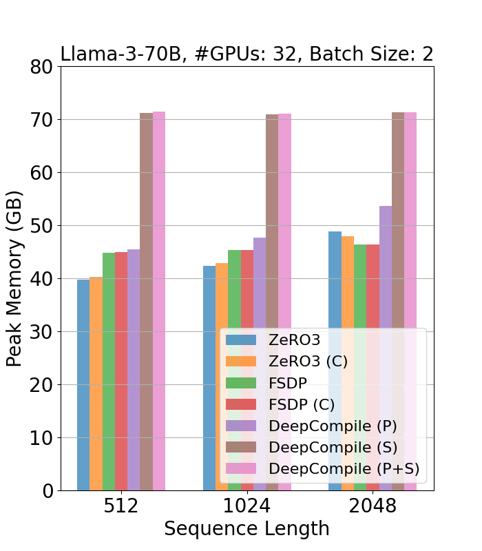
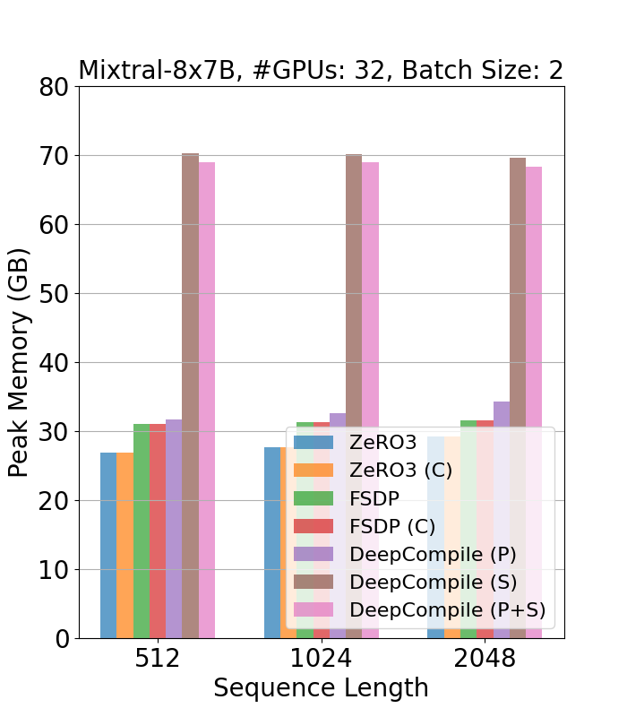

# Benchmarks for DeepCompile

## Setup

This experiment scripts require 4 nodes that has 8 A100/H100 GPUs each.
We tested the scripts with Python 3.10.12 and CUDA 12.4.

### Libraries

In addition, you need to install the following:

- PyTorch v2.6.0
- DeepSpeed v0.16.5
- transformers
- accelerate
- datasets v3.1

Here are an example of installation commands:

```bash
pip3 install torch==2.6.0 torchvision torchaudio
pip3 install transformers datasets==3.1 accelerate

# Install DeepSpeed and DeepCompile
git clone -b no_z3_hook https://github.com/tohtana/DeepSpeed
pip install -e DeepSpeed

# Clone this repository
git clone https://github.com/tohtana/bench_deep_compile
```

You need to set up these on all nodes.

### Setup for multiple nodes run

You need to set host names in /job/hostfile. The file should look like the following:

```
node-0 slots=8
node-1 slots=8
node-2 slots=8
node-3 slots=8
```

## Evaluation on throughput and peak memory

The following script runs the throughput benchmark. This sweeps the following conditions:

- Models: meta-llama/Meta-Llama-3-70B-Instruct, mistralai/Mixtral-8x7B-v0.1
- Batch size: 1, 2, 4
- Sequence length: 512 1024 2048
- Frameworks: DeepSpeed, DeepSpeed (C), FSDP, FSDP (C), DeepCompile (P), DeepCompile (S), DeepCompile (P+S)

The script downloads the models from HuggingFace Model Hub. Please make sure that you have access to the models.

```bash
export PROFILE_DIR=/path/to/profile
bash run_bench.sh
```

The logs resulting from our experiments are stored in `logs/` directory. The summary of results is `results/acc_step_1/results.txt`. You can plot these results using the following script. The generated charts will be saved in the `results/acc_step_1/`.

```bash
python plot.py --result_dir results/acc_step_1 --metric throughput
python plot.py --result_dir results/acc_step_1 --metric peak_mem
```

Here are some example charts:

Throughput

<table>
  <tr>
    <td></td>
    <td></td>
  </tr>
</table>

Peak memory

<table>
  <tr>
    <td></td>
    <td></td>
  </tr>
</table>

The following script runs the benchmark with different number of gradient accumulation steps (2, 4, 8, 16).
The batch size and sequence length are fixed to 1 and 1024, respectively. (Note that FSDP doesn't work for this experiment)

```bash
bash run_bench_acc.sh
```

You can use the same script with `--acc_step_eval` to plot the results along gradient accumulation steps.

```bash
python plot.py --result_dir results/acc_step_1_16 --acc_step_eval --metric throughput
```
