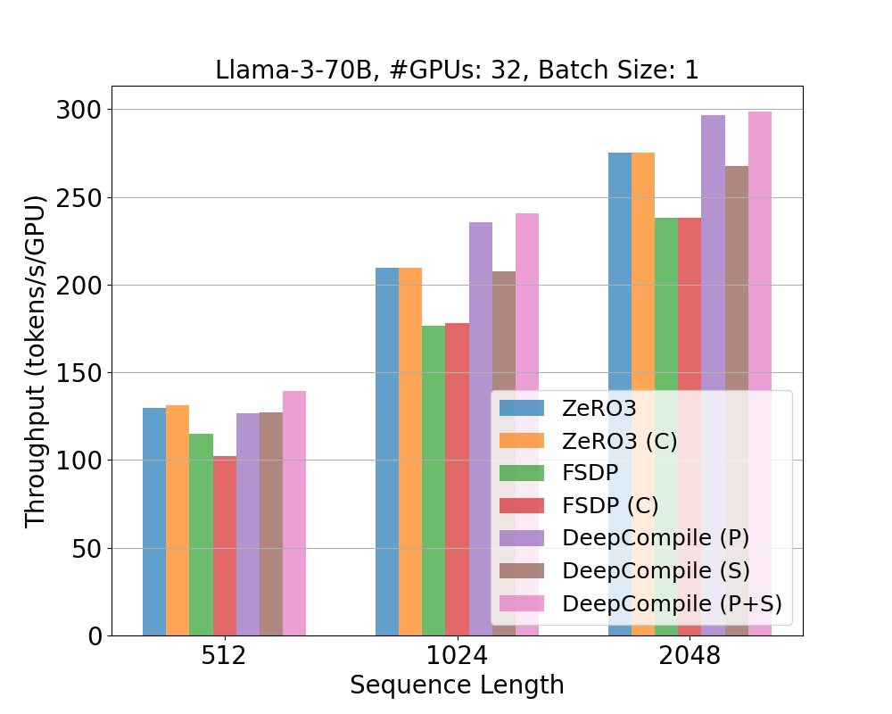
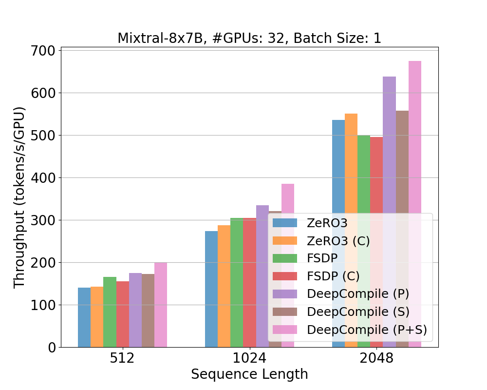
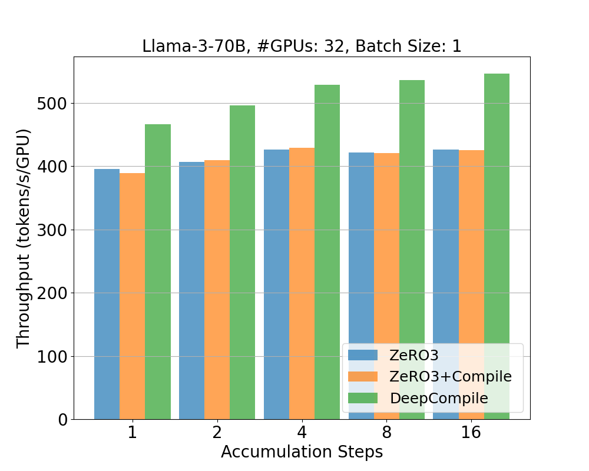
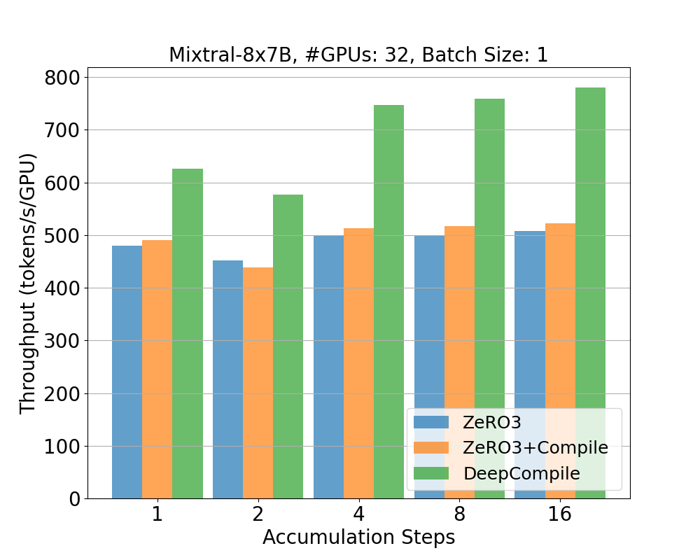

# Benchmarks for DeepCompile

## Setup

This experiment scripts require 4 nodes that has 8 A100/H100 GPUs each.
We tested the scripts with Python 3.10.12 and CUDA 12.4.

### Libraries

In addition, you need to install the following:

- PyTorch v2.6.0
  - For the Mixtral model, we recommend using PyTorch v2.7.0 (currently the final release candidate) due to an issue with `torch.where`.
  - See details [here](https://github.com/pytorch/pytorch/issues/149278)
- DeepSpeed (v0.16.6 or newer)
  - As DeepCompile is under active development, we recommend using the latest version or installing from source.
- transformers
- accelerate
- datasets v3.1

Here are an example of installation commands:

```bash
pip3 install torch==2.6.0 torchvision torchaudio
pip3 install transformers datasets==3.1 accelerate

# Install DeepSpeed
pip install deepspeed

# Or install the latest revision of DeepSpeed from source
# git clone https://github.com/deepspeedai/DeepSpeed
# cd DeepSpeed
# git pip install .
# cd ..

# Clone this repository
git clone https://github.com/deepspeedai/DeepSpeedExamples
cd benchmarks/deepcompile
```

You need to set up these on all nodes.

### Setup for multiple nodes run

You need to set host names in `hostfile_n${NUM_NODES}`. The file should look like the following:

```
node-0 slots=8
node-1 slots=8
node-2 slots=8
node-3 slots=8
```

## Evaluation on throughput

The following script runs the throughput benchmark. This sweeps the following conditions:

- Models: meta-llama/Meta-Llama-3-70B-Instruct, mistralai/Mixtral-8x7B-v0.1
- Batch size: 1, 2, 4
- Sequence length: 512 1024 2048
- Frameworks and settings:
  - DeepSpeed ZeRO3 (ZeRO3)
  - DeepSpeed ZeRO3 +Compiler (ZeRO3 (C))
  - FSDP (FSDP)
  - FSDP + Compiler (FSDP (C))
  - DeepCompile + proactive prefetching (DeepCompile (P))
  - DeepCompile + selective unsharding (DeepCompile (S))
  - DeepCompile + proactive prefetching + selective unsharding (DeepCompile (P+S))

The script downloads the models from HuggingFace Model Hub. Please make sure that you have access to the models.

```bash
export PROFILE_DIR=/path/to/profile
bash run_bench.sh
```

The logs resulting from our experiments are stored in `logs/` directory. The summary of results is output to `profiles/result.txt`. You can copy the file to `results/acc_step_1` and plot the throughput with the following commands.

```bash
python plot.py --result_dir results/acc_step_1 --metric throughput
```

Here are some example charts:

<table>
  <tr>
    <td></td>
    <td></td>
  </tr>
</table>

The following script runs the benchmark with different number of gradient accumulation steps (2, 4, 8, 16).

The batch size and sequence length are fixed to 1 and 1024, respectively. (Note that FSDP doesn't work for this experiment)

```bash
bash run_bench_acc.sh
```

You can use the same script with `--acc_step_eval` to plot the results along gradient accumulation steps.

```bash
python plot.py --result_dir results/acc_step_1_16 --acc_step_eval --metric throughput
```

Here are some example charts:

<table>
  <tr>
    <td></td>
    <td></td>
  </tr>
</table>

## APIs and custom optimization passes

To enable DeepCompile, simply set "deepcompile": true in the compile section of your DeepSpeed configuration JSON:

```json
{
…
    "zero_optimization": {
        "stage": 3,
    },
    "compile": {
        "deepcompile": true,
    },
…
}
```

In your training script, call the compile() API to invoke DeepCompile. The function signature is:

```python
def compile(self, backend=get_accelerator().get_compile_backend(), compile_kwargs={}, schedule=None) -> None:
```

You can pass a custom optimization schedule using the schedule argument. For example, to apply ZeRO-3-style partitioning and the optimizations described above, you can define the schedule as follows:

```python
schedule = []
schedule.append((0, [zero3_compile.add_z3_gather_release]))
schedule.append(
      (WARMUP,
      [zero3_compile.add_z3_gather_release, prefetch.schedule_prefetch, selective_gather.selective_gather]))
```

A schedule is defined as a list of tuples, where each tuple consists of:

- A step index (e.g., 0 or "WARMUP"), indicating when to apply the passes
- A list of optimization functions to apply at that step

In the example above, `add_z3_gather_release` is applied at step 0 to minimize memory usage. After a warmup phase (e.g., after the first few training iterations), additional optimizations such as prefetching and selective unsharding are applied based on profiled memory usage.
Each optimization pass takes a standardized set of arguments provided by DeepCompile. For details, please refer to the implementation of each pass:

- [ZeRO3 (All-gather and reduce-scatter insertion)](https://github.com/deepspeedai/DeepSpeed/blob/master/deepspeed/compile/passes/zero3_compile.py)
- [Proactive prefetching](https://github.com/deepspeedai/DeepSpeed/blob/master/deepspeed/compile/passes/prefetch.py)
- [Selective unsharding](https://github.com/deepspeedai/DeepSpeed/blob/master/deepspeed/compile/passes/selective_gather.py)
- [Reduce-scatter insertion (ZeRO1)](https://github.com/deepspeedai/DeepSpeed/blob/master/deepspeed/compile/passes/zero1_compile.py)
- [Adaptive offloading](https://github.com/deepspeedai/DeepSpeed/blob/master/deepspeed/compile/passes/offload_adam_states.py)
