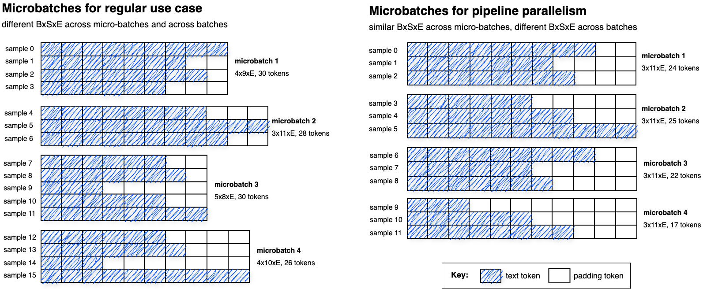

# Background and rationale

In many use cases, particularly LLMs, one is faced with inputs (sentences) of variable lengths. A common practice is to pack batches by token count (not a fixed batch size), ie by putting together sentences whose given metric (eg sequence lengths) will add up to an user-provided value.  As an example, in [Attention is all you need](https://arxiv.org/abs/1706.03762), section 5.1:

> Sentence pairs were batched together by approximate sequence length. Each training
batch contained a set of sentence pairs containing approximately 25000 source tokens and 25000
target tokens.

Dynamic batch sizes has been requested in [DeepSpeed issue 1051](https://github.com/microsoft/DeepSpeed/issues/1051), [DeepSpeed issue 3455 ](https://github.com/microsoft/DeepSpeed/issues/3455), [Pytorch Lightning issue 16914](https://github.com/Lightning-AI/pytorch-lightning/issues/16914),  [huggingface issue 2647](https://github.com/huggingface/accelerate/issues/2647) and is available already in many libraries e.g. [NVIDIA Triton](https://github.com/triton-inference-server/server/blob/main/docs/user_guide/model_configuration.md#dynamic-batcher) and [Meta FairSeq](https://github.com/facebookresearch/fairseq) (implementation [here](https://github.com/facebookresearch/fairseq/blob/34973a94d09ecc12092a5ecc8afece5e536b7692/fairseq/data/fairseq_dataset.py#L104) ). Dynamic batching support is available in DeepSpeed versions >= [0.16.5](https://github.com/deepspeedai/DeepSpeed/releases/tag/v0.16.5).

The immediate use case for this is when one needs to maximize GPU utilization. Moreover, this is particularly relevant for curriculum learning where a `BxSxE` (Batch x Sequence Length x Embedding) -shaped input should ideally have high `B` and low `S` at the early curriculum steps (many short sentences packed together as a batch), and low `B` and high `S` at the late steps (few long sentences in the batch). A dynamic size `S` is already supported by Deepspeed, e.g. in the documentation for pipeline parallelism's [reset_activation_shape()](https://deepspeed.readthedocs.io/en/stable/pipeline.html#deepspeed.runtime.pipe.engine.PipelineEngine.reset_activation_shape):
> For curriculum learning that changes the seqlen of each sample, we need to call this whenever the seqlen is going to change.

However, dynamic `B` is not supported. A dynamic `B` would require an adequate increase/decrease of learning rate. This technique has been applied previously, and the two most common LR scaling algorithms have been described as:
1. Linear Scaling Rule: "When the minibatch size is multiplied by k, multiply the learning rate by k", as in [Accurate, Large Minibatch SGD: Training ImageNet in 1 Hour, Goyal et al.](https://arxiv.org/abs/1706.02677)
2.  Square Root scaling: "when multiplying the batch size by k, multiply the learning rate by √k, to keep the variance in the gradient expectation constant" by  [One weird trick for parallelizing convolutional neural networks, A. Krizhevsky et al.](https://arxiv.org/abs/1404.5997)

In practice, the user picks the total token count per batch as the metric that drives batching, instead of batching by sentence count. During runtime, the variable batch size is computed and the LR is adjusted respectively, based on the LR and batch size provided by the config.

# Illustration of dynamic batch size, sequence length and LR

Imagine we pick a limit of 30 tokens per micro-batch, i.e. the `BxSxE` data per iteration per GPU will pack as many sequences as it needs to (ie increase `B`) so that the total tokens in that iterations at most 30, not more. We have also set **reference** learning rate of `lr=1e-3` for a `train_batch_size=2` in the deepspeed config. The batching algorithm for curriculum may pack the data into batches of short sentences (left) at the early stages, and batches of long sentences (right) as later stages, as pictured below. At every iteration, the learning rate will be adjusted based on the final batch size (i.e. the sum of all micro-batch sizes `B` across all GPUs and gradient accumulation steps):  


In the example above, we collected samples until we filled the micro-batches with at most 30 tokens. The final micro-batch sizes was then 10 and 4 on the left and right examples, respectively. Using the linear scaling rule, the LR for those batches become `5e-3` and `2e-3`. For simplicity, only 1 GPU is illustrated above, so the LR at every iteration only accounts for the micro-batch size in one GPU. We will cover the multi-GPU use case in the next section.

# Pipeline parallelism

Pipeline parallelism requires the same micro-batch size and sequence length across all micro-batches in a batch, as the activation sizes must be fixed between gradient accumulation steps. Between batches, these may change, as long as `engine.reset_activation_shape()` is called so that the new shapes are communicated on the first gradient accumulation step in the batch. Enforcing similar `BxSxE` between batches may lead to smaller micro-batches. As an example, below we can see an illustration of 4 micro-batches (equivalently, a 2-node 2-gradient-accumulation-step setp ) for the same dataset, when preparing data for the regular Distributed Data Parallel (DDP, left) and for the pipeline parallelism use cases (right):



We can see that the pipeline use case (right) has the same `BxSxE` shape across all the 4 micro-batches. However, in order to respect that, it packs less samples in the microbatch and adds padding, when compared to the standard use case (on the left). As an important reminder, the learning rate would now be ajusted taking into account the batch size of 16 and 12 samples for the left and right examples respectively (ie **LR is scaled based on the global batch size and not on the per-GPU micro-batch size**).  

# Attention Head

For an input of size `BxSxE` the attention has a shape of `SxS` for a mask of fixed size across samples of same size, or `BxSxS` for a different mask per sample (when samples have different sizes, as in the dataset above). This 3D attention matrix can be illustrated for the DDP micro-batch 1 (picture above top-left, 4 sentences)  as:
 


Note the memory savings: the attention head has a size of `BxSxS`, i.e. a linear memory dependency on the batch size `B` and quadratic memory dependency on the largest sequence length `S` in the (micro-) batch. Thus, supporting a dynamic size `S` allows for an increase of `B`.

# PR overview

This PRs implements dynamic batching and LR scaling. The dataloader and LR scheduler necessary can be retrieved by calling `get_dataloader_and_lr_scheduler_for_variable_batch_size`. A small explanation of that function follows:
- The logic behind the algorithms for LR scaling is in `scale_lr`;
- The partitioning of samples into batches is done by `batch_by_seqlen`.
- For pipeline parallelism, it is required that all micro-batches in a pipeline pass to have the same activation shapes. This is enabled by setting to `True` the following parameters:
  - `required_microbatches_of_same_sizes` that will force the `B` dimension to be the same across all gradient accumulation steps of all dataloaders on a batch;
  - `required_microbatches_of_same_lengths` that will force the `S` dimension to be the same across all gradient accumulation steps. Works by calling the user-provided `sample_padding_fn(sentence, len)` that pads a given sentence to the argument length;
  - `batch_by_seqlen` returns `microbatch_sample_ids` (the list of sample ids per micro-batch), `batch_sizes` (the size of effective batch sizes, and `batch_max_seqlens` (longest sequence across all microbatches in a batch)
- `dataloader_for_variable_batch_size` relies on `microbatch_sample_ids` and will iterate/collate/pad samples for every batch and return a dataloader that iterates the final (variable-size) batches;
- `lr_scheduler_for_variable_batch_size` relies on `batch_sizes` to compute the learning rate for each effective batch, taking into account the batch size and LR in the config file, and scaling the LR based on the size of each effective batch, and the scaling rule mentioned above (Linear, Square root, etc).
  - Special note to the `lr_scheduler` returned that will accept either:
    1.  an user-provided `Optimizer` that will  scale the learning rates (in param groups) at every batch, or
    2. an user-defined `LRScheduler`, that in this case will first get the learning rate from the scheduler and then scale it accordingly.

# Example

This example in `variable_batch_size_and_lr_example.py` presents a use case with and without pipeline parallelism. The example shows an attention head with attention of variable-sized `BxSxS` per batch, followed by a fixed size feed forward network. These are the main blocks on a Large Language Model. The feed-forward (or linear layer) that follows the attention head requires a constant input size, equivalent to the largest sentence in the whole dataset, so the output of the attention must be padded (see `feedforward: needs to convert BxSxE to BxMxE by padding extra tokens` in the code).


# Config

Relevant deepspeed config with comments:

```python
config = {
  "train_batch_size": 16,
  # `train_micro_batch_size_per_gpu` tells how many sequence packs of `max_tokens` each will be collated together.
  #  I.e. the number of tokens per micro batch (ie per gpu iteration) is `train_micro_batch_size_per_gpu`*`max_tokens`.
  "train_micro_batch_size_per_gpu": 2,
  "data_efficiency": {
    "enabled": True,
    # seed to be applied to all data efficiency modules, including dynamic batching
    "seed": 42,
    "data_sampling": {
      "num_workers": 0, # dataloader num_workers argument
      "pin_memory": False,  # dataloader pin_memory argument
      "dynamic_batching": {
        # enables or disables dynamic batching
        "enabled": True,
        # how many tokens we need to fill a pack of sequences (that will be collated together as a sample)
        "max_tokens": 100,
        # Input and output write to read from or write the length of every sequence.
        # Sequence lengths will be loaded from: {metrics_path}/seqlen/seqlen_sample_to_metric.bin and *.idx
        # If files dont exist, they'll be computed and saved on the first run, and loaded on subsequent runs.
        "metrics_path": "./curriculum_output/",
        # As batch size increases/decreses, which method to use to scale LR accordingly?
        # Options: linear, sqrt (square root), or None to disable
        "lr_scaling_method": "linear",
        # how to pick sentences to be packed into samples:
        # - dataloader: by same order as they come in with the dataloader
        # - seqlen: by sequence length (shortest to longest)
        # - random: random order using the seed in config['data_efficiency']['seed'
        "sentence_picking_order": "dataloader",  # "random" / "seqlen" / "dataloader"
        # minimum number of sequences required to reach `max_tokens`. If sentence pack is smaller, it's discarded.
        "min_batch_size": 1,
        # maximum number of sequences required to reach `max_tokens`. If sentence pack is larger, it's discarded.
        "max_batch_size": 10,
        # enable the output of microbatching information about sentence packing
        "verbose": True,
      },
    },
  },
}
```

